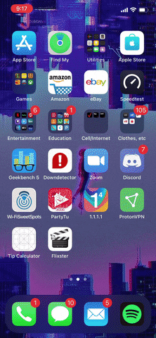

# Flixster
iOS Flixster App

Overview
For this unit's app assignment, you'll build the first part of a movie browsing app--similar to Fandango and Rotten Tomatoes--that lets a user view and scroll through a list of movies. To do this, you'll learn how to get data from the internet (via an API) and display it in a scrollable list in your app; two core concepts you'll use in virtually every app you'll ever build! When finished, your app will look similar to the app pictured above.

User Stories - What will our app do?
A user story simply describes the stuff we want a user of our app to be able to do. We'll break up each project into required and bonus user stories. Once we've listed out what our app should do, we can create a plan of attack.

Required User Stories
User sees an app icon on the home screen and a styled launch screen.
User can view and scroll through a list of movies now playing in theaters.
User can view the movie posters in each row.
Bonus User Stories
User can view the app on various device sizes and orientations.
Run your app on a real device.
Plan of Attack
Before we dive into building our app, it's helpful to think about a high level approach to how you will implement your user stories. Here's what we'll need to do in a nutshell.

Get a list of movies--including info about each movie, i.e. title, description and movie poster image.
To get our movie info, we'll work with a web based API whose purpose is to send back whatever data we request. APIs are how all mobile apps get data from the web, Facebook, Instagram, Twitter...if it accesses the internet, it's accessing an API. Every project in this course will pull in data from a web based API, however you do NOT need to know the ins-and-outs of APIs to use them, just like you don't need to know the ins-and-outs of how a car's engine works to drive one. All you'll need to know is a few basic concepts and terms which we'll cover in the walkthough videos as we build the app--so buckle up, grab the wheel and let's burn some API rubber! 🏎
Display each movie in a way that allows a user to scroll up and down to see all movies.
Once we get our movie list and info, we'll want to display are movies for the user to view. Since we'll have more movies then we can fit on the screen, we'll need to make the list scrollable. Every app has a scrollable view somewhere--think of your facebook news feed, instagram feed, twitter feed...even your settings screen. Thankfully, iOS features a pre-made view for exactly this application, all we have to do is set it up. Enter, the Table View: a view that allows us to take any list of things--movies, tweets, posts, snaps--and display each thing in it's own space on the screen. It also allows users to scroll up and down to their hearts content in order to view everything on the list.

